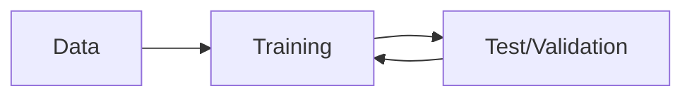

---
{"dg-publish":true,"permalink":"/ai-models-in-healthcare/"}
---

## What is AI?
>**Definition.** Artificial Intelligence refers to any program or system that can do things usually done by human reasoning. 
>
>Examples: decision-making; creating art; executing complex tasks; research; recommending a good movie

----
## How does it work?
All commercial AI models are built using **Machine Learning** (ML).

*How we learn:*

*ML:*

Learn more about ML [here](https://mitsloan.mit.edu/ideas-made-to-matter/machine-learning-explained).

----
## What should I care about!?
Most relevant AI models for you today are *Large Language Models* or *Agents*.

### [[Large Language Models\|Large Language Models]]
>**Defn.** A **Large Language Model** is trained on large text datasets. 
>
>Given input text, its purpose is to *predict* and *generate* the most likely text that follows.

LLMs include ChatGPT, OpenEvidence, and Claude.

### [[Agents\|Agents]]
>**Defn.** An **Agent** is trained to perceive its environment, reason, plan, and execute tasks to achieve specific goals. 

Agents are typically categorized as **reactive** or **autonomous**, or lie on some sliding scale between.
