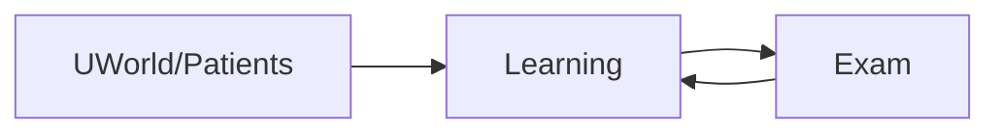
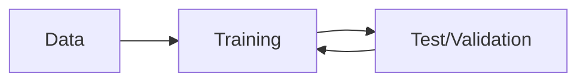

---
{"dg-publish":true,"permalink":"/welcome/","tags":["gardenEntry"]}
---

*Updated 09.16.2025*

Consider your [reflections](<Introduction Prompts>) on your experience with AI in rotations.

# Hi!
This is a course website for the Interclerkship Week session "Catching up to speed on Clinical Artificial Intelligence: Prompting, Scribes, Risk Prediction, Agents, Frameworks". 

This session assumes no prior knowledge of Artificial Intelligence. 

- **Objectives:** To use clinical AI tools *efficiently* and *judiciously*; to understand and circumvent their vulnerabilities and perverse behaviors; to explain AI's technology, risks, and benefits to patients. 
- **How to use:** Browse the table of contents or the sidebar for pages. Or follow along! 

We'll start with defining terms.

---
# AI Models in Healthcare

## What is AI?
>**Definition.** Artificial Intelligence refers to any program or system that can do things usually done by human reasoning. 
>
>Examples: decision-making; creating art; executing complex tasks; research; recommending a good movie

----
## How does it work?
All commercial AI models are built using **Machine Learning** (ML).

*How we learn:*

*ML:*

Learn more about ML [here](https://mitsloan.mit.edu/ideas-made-to-matter/machine-learning-explained).

----
## What to care about
Most relevant AI models for you are *Large Language Models* or *Agents*.

>**Defn.** A Large Language Model is trained on large text datasets. Given input text, its purpose is to *predict* and *generate* the most likely text that follows.

>**Defn.** An Agent is trained to perceive its environment, reason, plan, and execute tasks to achieve specific goals.

---- 
## LLMs 
LLMs include ChatGPT, OpenEvidence, and Claude.

We interact with LLMs by [Prompting them](<Prompting Fundamentals>). It's important to have a standardized format for how we prompt LLMs when using them in clinical care.

Uses include summarizing patient notes, answering medical questions, drafting documentation.

It's important to [use the right tool for the right use case](<LLM Comparison>).

----

## Further Reading 
- To tinker with advanced AI and keep up with research, see [[Frontier Models\|Frontier Models]]